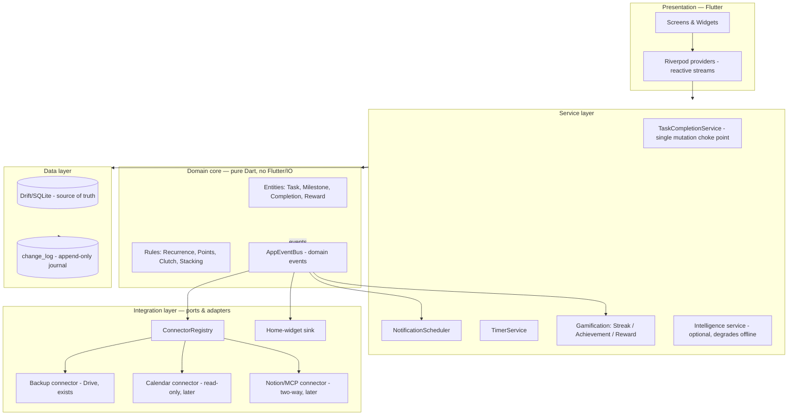

# Architecture Vision — Kaizn Productivity App

*Written 2026-07-18. The north-star design for evolving the app from a
gamified habit tracker into an extensible productivity system — without
losing the simplicity, speed, or offline-first character that make it work.*

---

## 1. Product thesis

**The moat is the behavior engine, not task storage.**

Notion, Todoist, and Google Tasks all store tasks better than we ever will.
What they don't have is a *behavioral loop*: points → streaks → rewards →
identity → celebrations, tuned to make doing the thing feel good. Every
architectural decision follows from this:

- Tasks/milestones are **data** — eventually they can live anywhere
  (our DB, Notion, a calendar).
- The behavior engine is **the product** — it must stay local, instant,
  and ours.
- Integrations therefore *feed* the engine; they never replace it.

One sentence: **Kaizn is the motivational layer over wherever your work
actually lives.**

## 2. Target architecture



### The four decisions that matter

**(1) Single mutation choke point.** Every completion/undo/skip flows through
`TaskCompletionService` (already planned in the Atomic Habits wave). No UI
surface talks to the DB mutation methods directly. This is what makes
everything else — events, sync, integrations, undo — possible without
touching 12 call sites.

**(2) Domain events over direct calls.** Formalize the `NotificationFeedback`
bus into an `AppEventBus` emitting typed domain events:
`TaskCompleted`, `TaskUndone`, `StreakAdvanced`, `RewardUnlocked`,
`TimerStarted/Stopped`, `TaskCreated/Edited/Deleted`. Subscribers:
notifications, gamification checks, the home widget, snackbar rendering,
and — tomorrow — connectors. Adding an integration becomes *subscribing*,
not *editing the core*.

**(3) Append-only change log.** A `change_log` table
(`id, entity_type, entity_id, op, payload_json, at, device_id, synced`)
written inside the same transaction as every mutation. Cost today: one
insert per write. What it buys, in order of arrival:
- **Now**: debounced auto-backup trigger ("something changed → back up in 5 min")
- **Soon**: audit/history UI ("what did I do this week"), robust undo
- **Later**: real multi-device sync (ship the journal, reconcile
  server-side) and the **outbox** for two-way integrations (push completions
  to Notion reliably, retry on failure)

This is the single highest-leverage "design now, pay later" investment.
Local-first stays intact: SQLite remains the source of truth; sync is a
replay of the journal, never a remote dependency.

**(4) Connectors are ports, not features.** One interface, registry-managed:

```dart
abstract class Connector {
  String get id;                        // 'gdrive', 'notion', 'gcal'
  Set<Capability> get capabilities;     // pullTasks, pushCompletions, backup…
  Future<void> sync(ChangeLogSlice outbox);
}
```

The existing Drive backup becomes the first `Connector`. Notion/MCP slots in
later with zero core changes: it maps external items into a `source_ref`
column on tasks (`notion:page_id`), pulls on open/interval, pushes via the
outbox. Conflict policy v1: **local wins for engine data (points, streaks,
completions — they're ours), remote wins for content (task names, notes —
it's theirs).**

## 3. The MCP strategy (honest version)

MCP on a phone has a real constraint: MCP servers/clients are long-lived
processes; a mobile app is not. Three phases that respect reality:

1. **Phase A — be a good citizen (cheap, now):** structured JSON
   export/import (exists via backup), plus share-sheet and deep links
   (`kaizn://add?name=…`) so other apps and automations (Tasker, Shortcuts)
   can talk to us today.
2. **Phase B — client of external services (medium):** connectors calling
   Notion/Google APIs directly from the app (OAuth per service). MCP not
   required for this — REST adapters behind the `Connector` port.
3. **Phase C — MCP surface (needs a companion):** a small sync backend (or
   desktop companion) that holds the replicated journal and exposes an MCP
   server: `list_tasks`, `add_task`, `complete_task`, `get_streak`,
   `get_week_stats`. Then any AI assistant (Claude, etc.) can read your
   habits and log completions conversationally. The change log from
   decision (3) is exactly the replication mechanism this needs.

Rule: **design the port now (source_ref column, Connector interface,
outbox), build transports only when a real use arrives.**

## 4. Feature map — six pillars

Everything the app has, is building, or could build, organized so nothing is
ever bolted on randomly. ✅ shipped · 🔨 current wave · 🔮 future.

| Pillar | Features |
|---|---|
| **Capture** (get it in, ≤2 taps) | ✅ quick-add FAB, last-used milestone · 🔮 share-sheet intake, natural-language add ("run mon/wed 7am 20pts"), voice capture, widget quick-add |
| **Plan** (shape the day) | ✅ recurrence engine, timeline w/ drag, due dates, reminder dates · 🔨 habit stacking · 🔮 calendar overlay (read-only feed), auto-schedule suggestions, weekly planning ritual |
| **Do** (execute with zero friction) | ✅ Today view, 4-state tiles, notification actions, exact-alarm reminders · 🔨 stopwatch-lite, last-call alerts · 🔮 focus mode (timer + DND + single task fullscreen), pomodoro preset |
| **Motivate** (the engine — our moat) | ✅ points, streaks + shield, rewards, badges, celebrations · 🔨 identity votes, never-miss-twice, clutch bonus · 🔮 quests (7-day arcs), variable rewards, leaderboards/social (per product vision), pet/garden metaphor |
| **Reflect** (close the loop) | ✅ stats, heatmap, time-of-day chart · 🔨 time invested · 🔮 weekly review ritual (Sunday: wins, misses, one tweak), insight cards ("you never do X on Fridays — move it?"), AI-written week summary |
| **Connect** (play well with others) | ✅ Drive backup, home widget · 🔮 auto-backup (change-log triggered), calendar in, Notion two-way, deep links, MCP surface, export |

**The Goldilocks loop (🔮, uses Intelligence service):** miss a task 3×
running → suggest shrinking it (two-minute rule); 14-day flawless streak on
an easy task → suggest leveling it up. This is the retention feature, and it
needs zero cloud — the rules run on local stats.

## 5. UX constitution

Principles that hold regardless of how many features exist:

1. **The 3-second answer.** Opening the app answers "what should I do right
   now?" in one glance. Today view is sacred; everything else is one tap away.
2. **One interaction grammar, everywhere.** Tap = do it. Long-press = more
   options. Swipe = navigate. A user who learns one tile has learned the app.
   (Discoverability debt: one-time coach mark, already planned.)
3. **Progressive disclosure as law.** Default surfaces show ≤5 elements. Power
   features live behind "More options", long-press, or Settings — the task
   form's default height should *shrink* over time, not grow (the "More
   options" expander in the stacking plan starts this).
4. **Defaults over configuration.** Every new feature ships working with zero
   setup. Settings exist to *turn things off*, not to make things work.
   Anything needing a tutorial gets redesigned.
5. **One attention slot.** At most one banner competes with the task list
   (priority: live timer > never-miss-twice > rewards). At most one snackbar,
   composed by one rule. Notifications per day soft-capped; quiet hours
   respected. The app is a coach, not a nag.
6. **Celebrate loud, guilt quiet.** Wins get confetti and sound; misses get
   one gentle line and a path back. Never two guilt surfaces for one miss.
7. **Speed is a feature.** Budgets: cold start < 2s, tap-to-feedback < 100ms
   (reactive Drift streams already deliver this), zero network on any hot
   path, everything works in airplane mode forever. Integrations sync in the
   background or not at all.
8. **Undo over confirm.** Never interrupt an action with "are you sure?" —
   let it happen and offer a 6s takeback (Option B pattern, already shipped).

## 6. What we deliberately do NOT build

- **General project management** — no kanban, subtask trees, assignees,
  comments. Notion exists; we integrate instead.
- **A backend before sync demand is real** — the change log makes us
  backend-*ready*; user accounts wait until multi-device or social actually
  hurts.
- **Configurable gamification** — point formulas, streak rules, bonus values
  are opinionated constants. Tunable engines stop feeling like games.
- **A chat UI** — AI features surface as one-tap suggestions and summaries
  inside existing screens, never a chatbot tab.

## 7. Getting there from today's code (incremental, no rewrite)

| Step | What | When |
|---|---|---|
| 1 | `TaskCompletionService` (single choke point) | Wave 0 of Atomic Habits plan — already specced |
| 2 | Rename/extend `NotificationFeedback` → `AppEventBus` with typed events; feedback snackbar becomes a subscriber | During Wave 0 (mechanical) |
| 3 | Add `change_log` table **into the v6→v7 batch** (one extra table, writes added inside existing transactions) | Wave 0 — cheapest moment is now |
| 4 | Debounced auto-backup driven by change_log (closes the long-standing backlog item) | After Wave 1 |
| 5 | Extract pure rules (`RecurrenceRule` already is; move points/clutch/stacking logic into `lib/domain/`) | Opportunistic, as files get touched |
| 6 | `Connector` interface; retrofit Drive backup as first connector; add `source_ref` column when the first real connector lands | With the first integration |
| 7 | Calendar read-only feed → timeline overlay | First external connector (lowest risk, high value) |
| 8 | Notion two-way via outbox; then MCP surface via companion/backend | When demand is real |

## 8. Phased roadmap

- **Phase 1 (now):** Atomic Habits wave + change_log + event bus — the app
  becomes architecturally extensible while shipping visible features.
- **Phase 2 (capture & reflect):** share-sheet + NL quick-add; weekly review
  ritual; auto-backup; insight cards. The daily loop gets stickier.
- **Phase 3 (connect):** calendar overlay → Notion connector → deep links.
  Kaizn becomes the motivational front-end to external systems.
- **Phase 4 (intelligence & social):** Goldilocks suggestions, AI week
  summaries, MCP surface, leaderboards/public rewards (per original product
  vision).

*Each phase is shippable alone; no phase blocks daily use of the previous one.*
